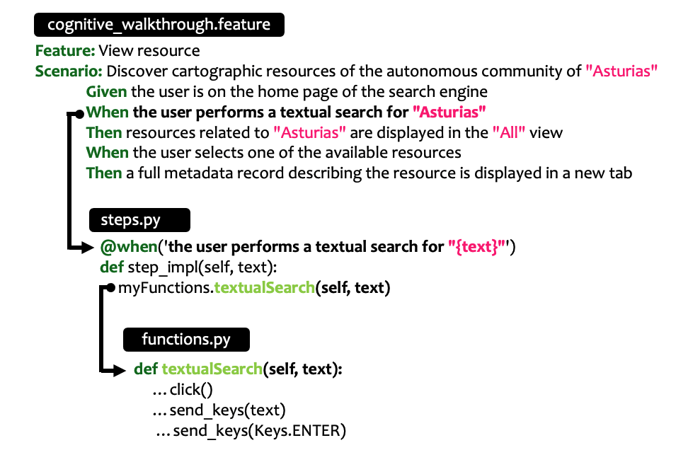

# Acceptance-testing-of-geospatial-semantic-search-engines-CNIG-ODECO-

This repository contains some python scripts for performing automatic acceptance tests for a geospatial semantic search engine and some python notebooks for the analysis of the data collected in the usability and performance evaluation tests.


# Table of Contents
1. [Scripts for performing branch testing](#example)
2. [Scripts for performing scenario testing](#example2)
3. [Scripts for performing cognitive walkthroughs](#third-example)
4. [Notebook for the analysis of System Usability Scale (SUS) scores](#fourth-examplehttpwwwfourthexamplecom)
5. [Notebook for the analysis of relevance evaluation by raters (prec@10)](#fourth-examplehttpwwwfourthexamplecom)


## Scripts for performing branch testing

## Scripts for performing scenario testing

## Scripts for performing cognitive walkthroughs

The test directory has the following structure:

```
functions/
functions/functions.py
features/
features/semanticsearch.feature
features/steps/
features/steps/steps.py
```



The file called functions.py stores the main operations that a user can perform while browsing the browser written in Selenium Python.

```python
# -- FILE: functions/functions.py
# Example

    def textualSearch(self, text):    
        WebDriverWait(self.driver, 60).until(EC.element_to_be_clickable((By.ID, "autocomplete"))).click()
        WebDriverWait(self.driver, 60).until(EC.element_to_be_clickable((By.ID, "autocomplete"))).send_keys(text)
        WebDriverWait(self.driver, 60).until(EC.element_to_be_clickable((By.ID, "autocomplete"))).send_keys(Keys.ENTER)
        time.sleep(60) 
```

The file named steps.py connects the steps of the feature file -semanticsearch.feature- with the Selenium functions -functions.py-.

```python
# -- FILE: features/steps/steps.py
# Example
@when('the user performs a textual search for "{text}"')
def step_impl(self, text):
    myFunctions.textualSearch(self, text)
```

The file called "semanticsearch.feature" stores  scenarios written in Gherkin.

```gherkin
# -- FILE: features/semanticsearch.feature
Feature: View resource
Scenario: Discover cartographic resources of the autonomous community of "Asturias"
Given the user is on the home page of the search engine
When the user performs a textual search for "Asturias"
Then resources related to "Asturias" are displayed in the "All" view
When the user selects one of the available resources
Then a full metadata record describing the resource is displayed in a new tab
```

Run the Feature Test

```
$ behave ../features/semanticsearch.feature

Feature: View resource   # ../features/semanticsearch.feature
Scenario: Discover cartographic resources of the autonomous community of "Asturias"
Given the user is on the home page of the search engine
When the user performs a textual search for "Asturias"
Then resources related to "Asturias" are displayed in the "All" view
When the user selects one of the available resources
Then a full metadata record describing the resource is displayed in a new tab

1 feature passed, 0 failed, 0 skipped
1 scenario passed, 0 failed, 0 skipped
5 steps passed, 0 failed, 0 skipped, 0 undefined
Took 39.433s
```

## Notebook for the analysis of System Usability Scale (SUS) scores

At the end of each usability test a questionnaire called System Usability Scale (SUS) was applied. The sample is divided into three groups: I. Novice Users, II. Expert Unfamiliar Users, III. Expert Familiar Users. First, the reliability of the questionnaire was measured with Cronbach's Alpha. Then, the medians were calculated according to the group of participants. Then, the Kruskal-Wallis test was applied to detect possible differences between the groups at the item level and in the total score. For significant items, a Dunn's test was performed to detect whether groups are statistically different. Finally, the Box plots of System Usability Scale (SUS) scores for each testing group are shown.

## Notebook for the analysis of relevance evaluation by raters (prec@10)

To determine the Precision@10 of the semantic search engine with respect to the other three baseline platforms, three raters classified the results of these systems for five information needs as relevant or not relevant. The notebook shows the calculation of Precision@10 according to information need and platform, as well as the calculation of the Fleiss' Kappa to measure the agreement between the raters.
